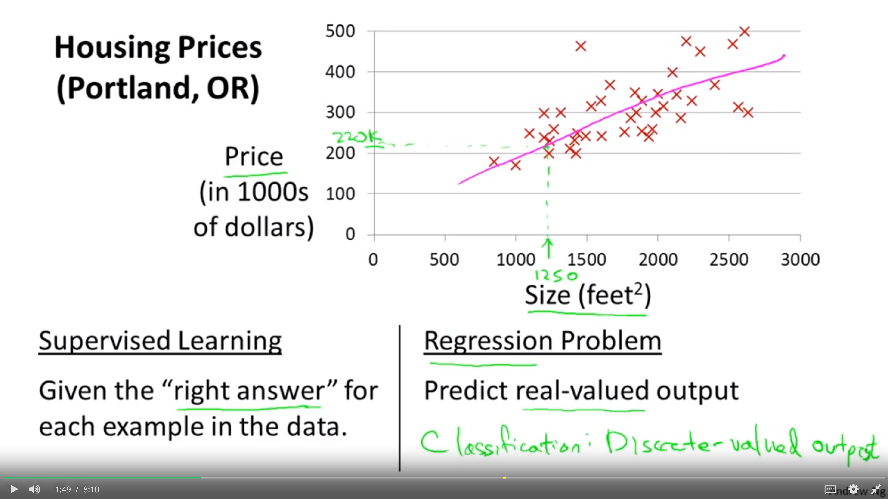
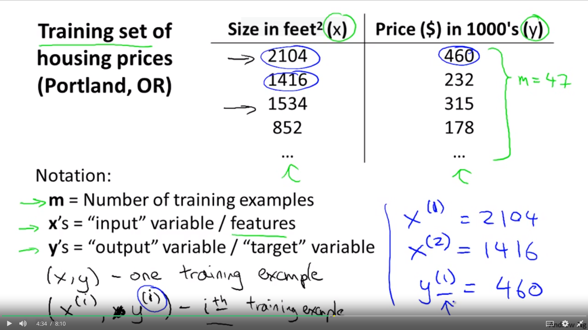
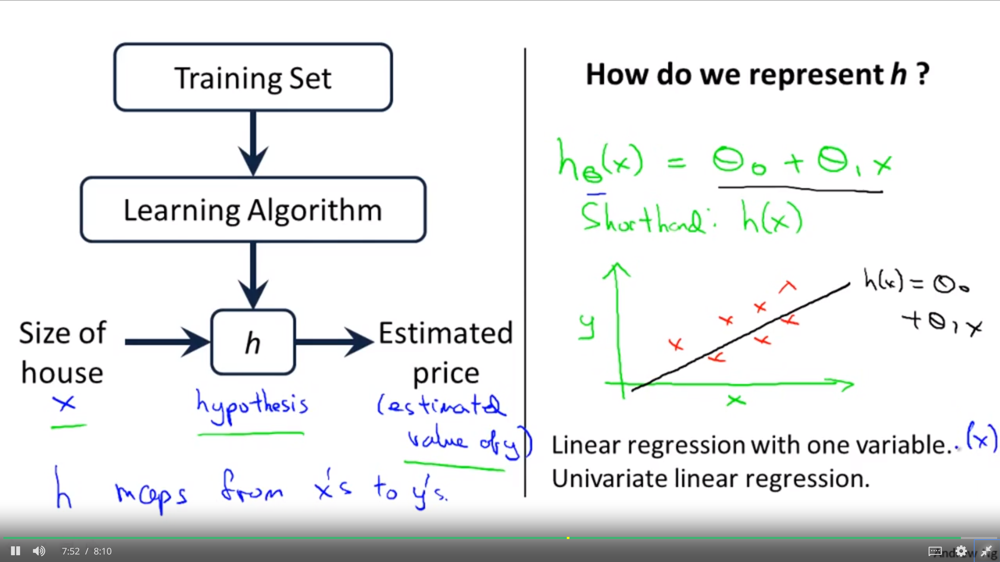

# Model Representation
To establish notation for future use, we’ll use x(i)   to denote the “input” variables (living area in this example), also called input features, and y(i)  to denote the “output” or target variable that we are trying to predict (price). 

A pair (x(i), y(i)) is called a training example, and the dataset that we’ll be using to learn—a list of m training examples (x(i), y(i)); i = 1, 2, ..., m—is called a training set. 
- Note that the superscript “(i)” in the notation is simply an index into the training set, and has nothing to do with exponentiation. 

We will also use X to denote the space of input values, and Y to denote the space of output values. In this example, X = Y = ℝ.

To describe the supervised learning problem slightly more formally, our goal is, given a training set, to learn a function h : X → Y so that h(x) is a “good” predictor for the corresponding value of y. For historical reasons, this function h is called a hypothesis. Seen pictorially, the process is therefore like this:

When the target variable that we’re trying to predict is continuous, such as in our housing example, we call the learning problem a regression problem. When y can take on only a small number of discrete values (such as if, given the living area, we wanted to predict if a dwelling is a house or an apartment, say), we call it a classification problem.

## Housing prices

1. Supervised learning
    - given the right example in the data

2. Regression Problem
    - predict real-valued output

## Parameters:
-----

- Training set S1(1, 2, ... m)
- size - **m**
- inputs - **x**
- outputs - **y**
- mapping function - **h**

- Learning algorithm
    - function h (Hypothesis)
    - e.g. size of house(x) -> h -> estimated price (y)
        - h maps from x to y
        - hθ(x) = θ0 + θ1x
    

- How to represent h?

