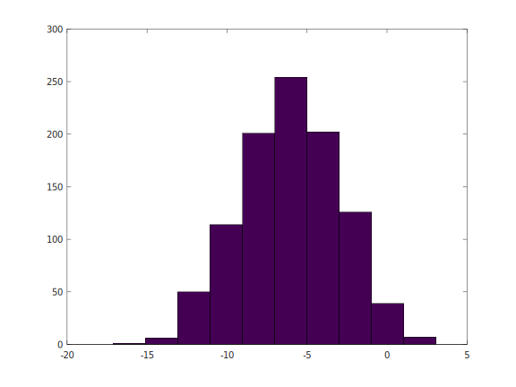
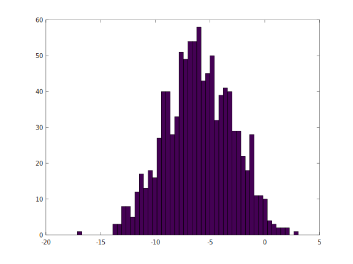

# Octave

1. Operators

```MATLAB
% comments

1 == 2
ans = 0

octave:6> 1 == 2
ans = 0
octave:7> 1 == 2 % false
ans = 0
octave:8> 1 ~= 2 % not equals
ans = 1
octave:9> 1 && 0
ans = 0
octave:10> 1 || 0
ans = 1
octave:11> xor(1,0)
ans = 1

eye(5)
ans =
Diagonal Matrix

   1   0   0   0   0
   0   1   0   0   0
   0   0   1   0   0
   0   0   0   1   0
   0   0   0   0   1

% change cli prompt [octave:#>] command
>>PS1('>>')
>> 1==1
ans = 1
```

2. Variables

```MATLAB
>>a = 3;
>>a = 3; %semicolon supresses output
>>a = 3
a =  3
>>b = 'hi';
>>b
b = hi
>>c = (3>=1);
>>c
c = 1


>>a = pi;
>>a
a =  3.1416
>>disp(a);
 3.1416
>>disp(sprintf('2 decimals: %0.2f', a))
2 decimals: 3.14
>>disp(sprintf('11 decimals: %0.11f', a))
11 decimals: 3.14159265359
>>disp(sprintf('11 decimals: %0.11f', a))
11 decimals: 3.14159265359
>>disp(sprintf('111 decimals: %0.1111f', a))
11 decimals: 3.1415926535897931159979634685441851615905761718750000000000000000000000000000000000000000000000000000000000000000000000000000000000000000000000000000000000000000000000000000000000000000000000000000000000000000000000000000000000000000000000000000000000000000000000000000000000000000000000000000000000000000000000000000000000000000000000000000000000000000000000000000000000000000000000000000000000000000000000000000000000000000000000000000000000000000000000000000000000000000000000000000000000000000000000000000000000000000000000000000000000000000000000000000000000000000000000000000000000000000000000000000000000000000000000000000000000000000000000000000000000000000000000000000000000000000000000000000000000000000000000000000000000000000000000000000000000000000000000000000000000000000000000000000000000000000000000000000000000000000000000000000000000000000000000000000000000000000000000000000000000000000000000000000000000000000000000000000000000000000000000000000000000000000000000000000000000000000000000000000000000000000000000000000000000000000000000000000000000000000000000000000000000000000000000000000000
>>format long
>>a
a =  3.141592653589793
>>format short
>>a
a =  3.1416

```

3. Matrices and vectors

```MATLAB
>>A = [ 1 2; 3 4; 5 6]
A =

   1   2
   3   4
   5   6

>>A = [ 1 2;
> 3 4;
> 5 6]
A =

   1   2
   3   4
   5   6

>>v = [1 2 3]
v =

   1   2   3

>>v = [1; 2;3]
v =

   1
   2
   3

>>v = 1:0.1:2 %increment by 0.1 from 1 to 2
v =

    1.0000    1.1000    1.2000    1.3000    1.4000    1.5000    1.6000    1.7000    1.8000    1.9000    2.0000


>> v = 1:6
v =

   1   2   3   4   5   6

 >> ones(2,3)
ans =

   1   1   1
   1   1   1

 >> C = 2*ones(2,3)
C =

   2   2   2
   2   2   2

 >> C = [2 2 2; 2 2 2]
C =

   2   2   2
   2   2   2

 >> w = ones(1,3)
w =

   1   1   1

 >> w = zeros(1,3)
w =

   0   0   0

 >> w = rand(1,3)
w =

   0.66179   0.25534   0.81229

 >> rand(3,3)
ans =

   0.649711   0.690268   0.384260
   0.355821   0.099851   0.258200
   0.541325   0.582549   0.398585

 >> rand(3,3)
ans =

   0.623467   0.171503   0.705994
   0.460802   0.768677   0.972369
   0.825439   0.043752   0.652824

 >> w = randn(1,3)
w =

   0.13841   0.67424   1.17112

 >> w = randn(1,3)
w =

   2.216017   0.056305  -0.739032

>> rand(3,3)
ans =

   0.649711   0.690268   0.384260
   0.355821   0.099851   0.258200
   0.541325   0.582549   0.398585

 >> rand(3,3)
ans =

   0.623467   0.171503   0.705994
   0.460802   0.768677   0.972369
   0.825439   0.043752   0.652824

 >> w = randn(1,3)
w =

   0.13841   0.67424   1.17112

 >> w = randn(1,3)
w =

   2.216017   0.056305  -0.739032

 >> w = -6 sqrt(10)*(randn(1,1000));
parse error:

  syntax error

>>> w = -6 sqrt(10)*(randn(1,1000));
              ^

 >> w = -6 + sqrt(10)*(randn(1,1000));
 >> hist(w)
```



```matlab
>> hist(w, 50)
```


- Identity matrix

```matlab
 >> eye(4)
ans =

Diagonal Matrix

   1   0   0   0
   0   1   0   0
   0   0   1   0
   0   0   0   1

 >> I = eye(7)
I =

Diagonal Matrix

   1   0   0   0   0   0   0
   0   1   0   0   0   0   0
   0   0   1   0   0   0   0
   0   0   0   1   0   0   0
   0   0   0   0   1   0   0
   0   0   0   0   0   1   0
   0   0   0   0   0   0   1

 >> help eye
'eye' is a built-in function from the file libinterp/corefcn/data.cc

 -- eye (N)
 -- eye (M, N)
 -- eye ([M N])
 -- eye (..., CLASS)
     Return an identity matrix.

     If invoked with a single scalar argument N, return a square NxN
     identity matrix.

     If supplied two scalar arguments (M, N), 'eye' takes them to be the
     number of rows and columns.  If given a vector with two elements,
     'eye' uses the values of the elements as the number of rows and
     columns, respectively.  For example:

          eye (3)
           =>  1  0  0
               0  1  0
               0  0  1

     The following expressions all produce the same result:

          eye (2)
          ==
          eye (2, 2)
          ==
          eye (size ([1, 2; 3, 4]))

     The optional argument CLASS, allows 'eye' to return an array of the
     specified type, like

          val = zeros (n,m, "uint8")

     Calling 'eye' with no arguments is equivalent to calling it with an
     argument of 1.  Any negative dimensions are treated as zero.  These
     odd definitions are for compatibility with MATLAB.

     See also: speye, ones, zeros.

Additional help for built-in functions and operators is
available in the online version of the manual.  Use the command
'doc <topic>' to search the manual index.

Help and information about Octave is also available on the WWW
at https://www.octave.org and via the help@octave.org
mailing list.

```


```matlab
 >> A = 1:6
A =

   1   2   3   4   5   6

 >> size(A)
ans =

   1   6

 >> sz = size(A)
sz =

   1   6

 >> size(sz)
ans =

   1   2

 >> size(A,1)
ans =  1
 >> size(A,2)
ans =  6
 >>
 >>
 >>
 >>
 >>
 >>
 >> v = [1 2 3 4]
v =

   1   2   3   4

 >> length(v) % use length for vectors
ans =  4
 >>
 >>
 >> length(A)
ans =  6
 >> length([1;2;3;4;5])
ans =  5
```
