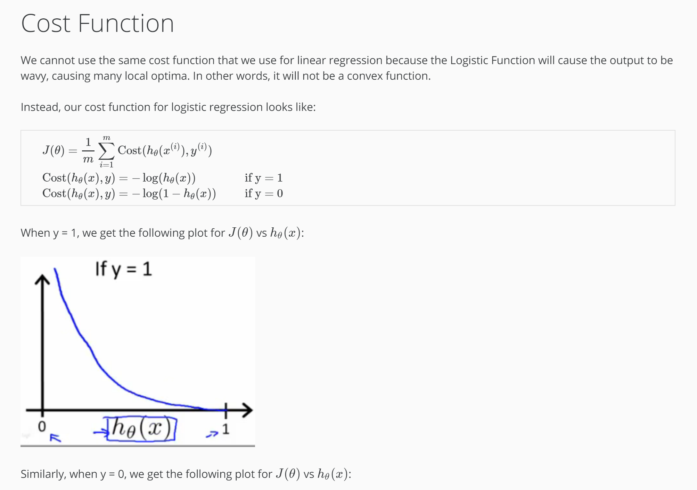
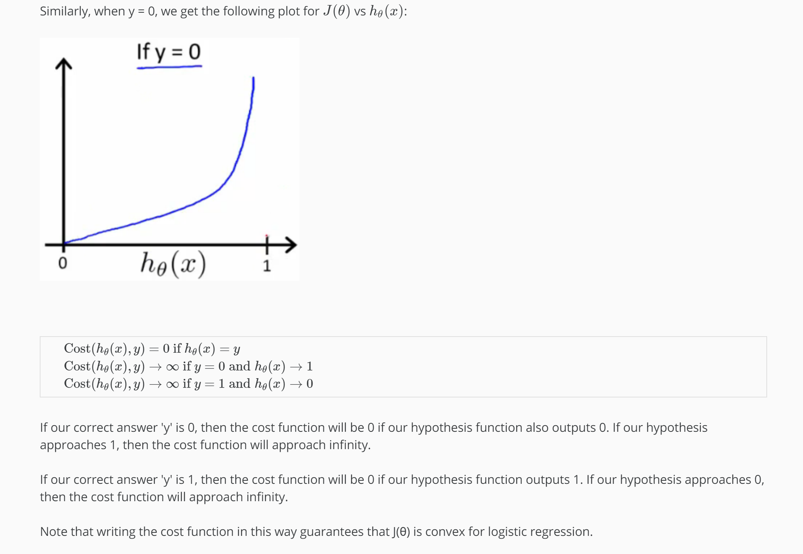
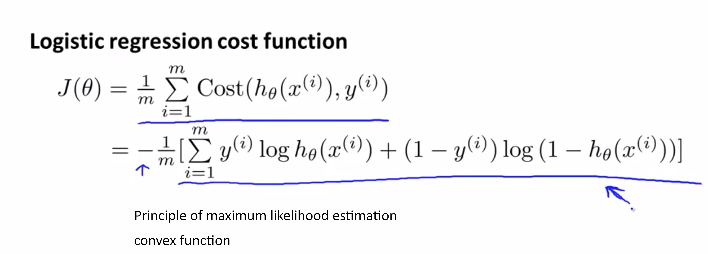

# Octave

1. Operators

Cost Function
We cannot use the same cost function that we use for linear regression because the Logistic Function will cause the output to be wavy, causing many local optima. In other words, it will not be a convex function.

Instead, our cost function for logistic regression looks like:

J(θ)=1m∑i=1mCost(hθ(x(i)),y(i))Cost(hθ(x),y)=−log(hθ(x))Cost(hθ(x),y)=−log(1−hθ(x))if y = 1if y = 0
When y = 1, we get the following plot for J(\theta)J(θ) vs h_\theta (x)h 
θ
​	 (x):

Similarly, when y = 0, we get the following plot for J(\theta)J(θ) vs h_\theta (x)h 
θ
​	 (x):

Cost(hθ(x),y)=0 if hθ(x)=yCost(hθ(x),y)→∞ if y=0andhθ(x)→1Cost(hθ(x),y)→∞ if y=1andhθ(x)→0
If our correct answer 'y' is 0, then the cost function will be 0 if our hypothesis function also outputs 0. If our hypothesis approaches 1, then the cost function will approach infinity.

If our correct answer 'y' is 1, then the cost function will be 0 if our hypothesis function outputs 1. If our hypothesis approaches 0, then the cost function will approach infinity.

Note that writing the cost function in this way guarantees that J(θ) is convex for logistic regression.

