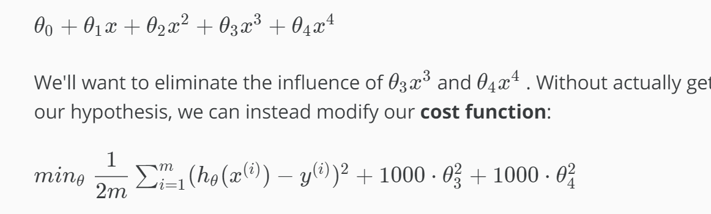
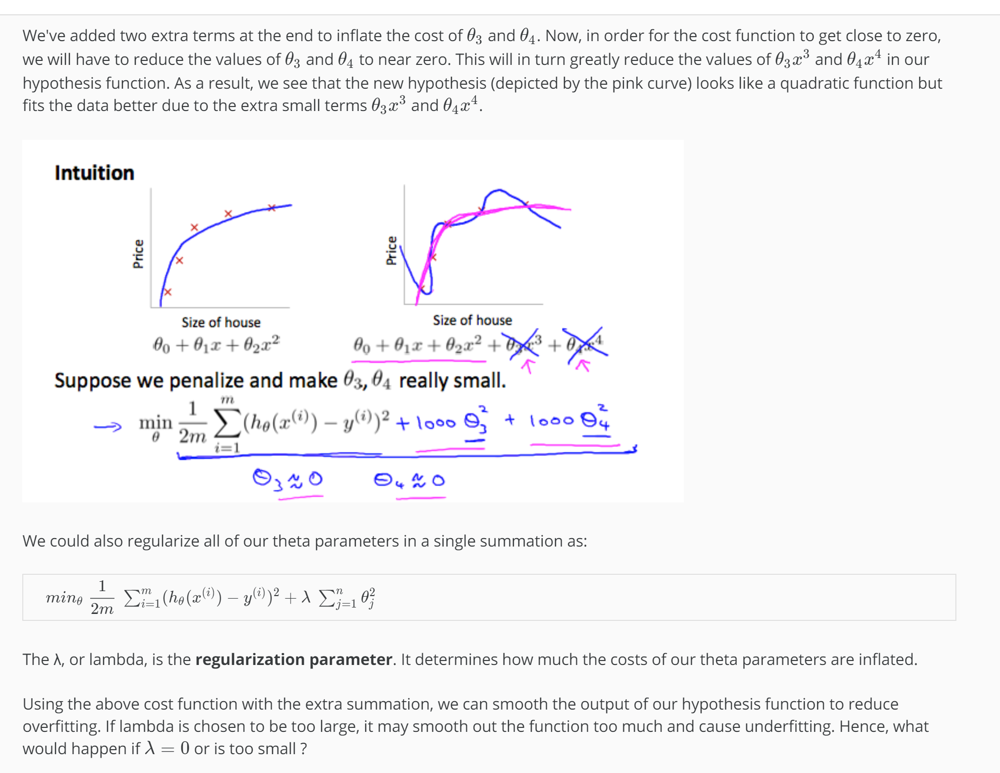

Cost Function
Note: [5:18 - There is a typo. It should be \sum_{j=1}^{n} \theta _j ^2∑ 
j=1
n
​	 θ 
j
2
​	  instead of \sum_{i=1}^{n} \theta _j ^2∑ 
i=1
n
​	 θ 
j
2
​	 ]

If we have overfitting from our hypothesis function, we can reduce the weight that some of the terms in our function carry by increasing their cost.

Say we wanted to make the following function more quadratic:

\theta_0 + \theta_1x + \theta_2x^2 + \theta_3x^3 + \theta_4x^4θ 
0
​	 +θ 
1
​	 x+θ 
2
​	 x 
2
 +θ 
3
​	 x 
3
 +θ 
4
​	 x 
4
 

We'll want to eliminate the influence of \theta_3x^3θ 
3
​	 x 
3
  and \theta_4x^4θ 
4
​	 x 
4
  . Without actually getting rid of these features or changing the form of our hypothesis, we can instead modify our cost function:

min_\theta\ \dfrac{1}{2m}\sum_{i=1}^m (h_\theta(x^{(i)}) - y^{(i)})^2 + 1000\cdot\theta_3^2 + 1000\cdot\theta_4^2min 
θ
​	   
2m
1
​	 ∑ 
i=1
m
​	 (h 
θ
​	 (x 
(i)
 )−y 
(i)
 ) 
2
 +1000⋅θ 
3
2
​	 +1000⋅θ 
4
2
​	 

We've added two extra terms at the end to inflate the cost of \theta_3θ 
3
​	  and \theta_4θ 
4
​	 . Now, in order for the cost function to get close to zero, we will have to reduce the values of \theta_3θ 
3
​	  and \theta_4θ 
4
​	  to near zero. This will in turn greatly reduce the values of \theta_3x^3θ 
3
​	 x 
3
  and \theta_4x^4θ 
4
​	 x 
4
  in our hypothesis function. As a result, we see that the new hypothesis (depicted by the pink curve) looks like a quadratic function but fits the data better due to the extra small terms \theta_3x^3θ 
3
​	 x 
3
  and \theta_4x^4θ 
4
​	 x 
4
 .

We could also regularize all of our theta parameters in a single summation as:

min_\theta\ \dfrac{1}{2m}\ \sum_{i=1}^m (h_\theta(x^{(i)}) - y^{(i)})^2 + \lambda\ \sum_{j=1}^n \theta_j^2min 
θ
​	   
2m
1
​	  ∑ 
i=1
m
​	 (h 
θ
​	 (x 
(i)
 )−y 
(i)
 ) 
2
 +λ ∑ 
j=1
n
​	 θ 
j
2
​	 
The λ, or lambda, is the regularization parameter. It determines how much the costs of our theta parameters are inflated.

Using the above cost function with the extra summation, we can smooth the output of our hypothesis function to reduce overfitting. If lambda is chosen to be too large, it may smooth out the function too much and cause underfitting. Hence, what would happen if \lambda = 0λ=0 or is too small ?

