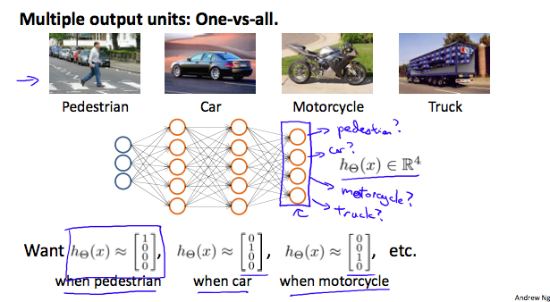
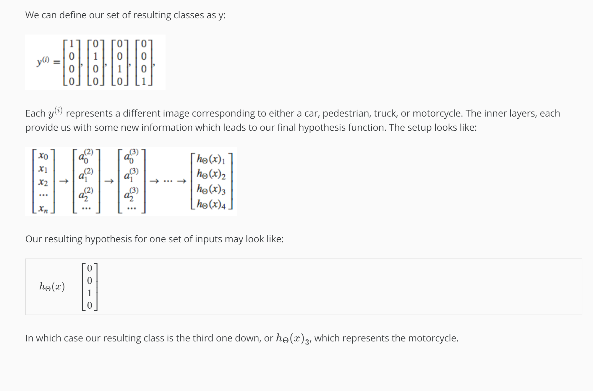

Multiclass Classification
To classify data into multiple classes, we let our hypothesis function return a vector of values. Say we wanted to classify our data into one of four categories. We will use the following example to see how this classification is done. This algorithm takes as input an image and classifies it accordingly:

We can define our set of resulting classes as y:

Each y^{(i)}y 
(i)
  represents a different image corresponding to either a car, pedestrian, truck, or motorcycle. The inner layers, each provide us with some new information which leads to our final hypothesis function. The setup looks like:

Our resulting hypothesis for one set of inputs may look like:

hΘ(x)=⎡⎣⎢⎢0010⎤⎦⎥⎥
In which case our resulting class is the third one down, or hΘ(x)3, which represents the motorcycle.

