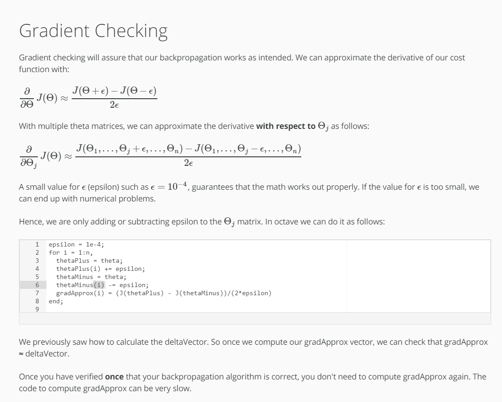

Gradient Checking
Gradient checking will assure that our backpropagation works as intended. We can approximate the derivative of our cost function with:

∂∂ΘJ(Θ)≈J(Θ+ϵ)−J(Θ−ϵ)2ϵ

With multiple theta matrices, we can approximate the derivative with respect to Θj as follows:

∂∂ΘjJ(Θ)≈J(Θ1,…,Θj+ϵ,…,Θn)−J(Θ1,…,Θj−ϵ,…,Θn)2ϵ

A small value for ϵ (epsilon) such as ϵ=10−4, guarantees that the math works out properly. If the value for ϵ is too small, we can end up with numerical problems.

Hence, we are only adding or subtracting epsilon to the Θj matrix. In octave we can do it as follows:

```MATLAB
epsilon = 1e-4;
for i = 1:n,
  thetaPlus = theta;
  thetaPlus(i) += epsilon;
  thetaMinus = theta;
  thetaMinus(i) -= epsilon;
  gradApprox(i) = (J(thetaPlus) - J(thetaMinus))/(2*epsilon)
end;
```

We previously saw how to calculate the deltaVector. So once we compute our gradApprox vector, we can check that gradApprox ≈ deltaVector.

Once you have verified once that your backpropagation algorithm is correct, you don't need to compute gradApprox again. The code to compute gradApprox can be very slow.

