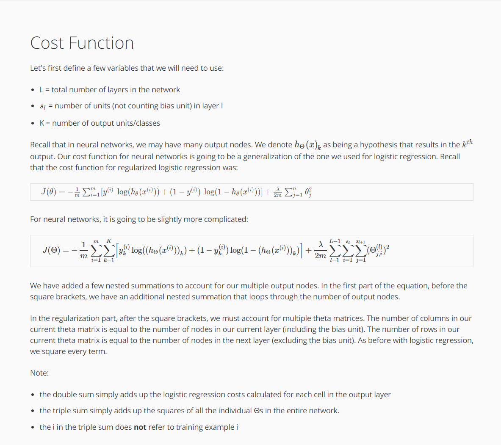

Cost Function
Let's first define a few variables that we will need to use:

L = total number of layers in the network
s_ls 
l
​	  = number of units (not counting bias unit) in layer l
K = number of output units/classes
Recall that in neural networks, we may have many output nodes. We denote hΘ(x)k as being a hypothesis that results in the k^{th}k 
th
 output. Our cost function for neural networks is going to be a generalization of the one we used for logistic regression. Recall that the cost function for regularized logistic regression was:

J(\theta) = - \frac{1}{m} \sum_{i=1}^m [ y^{(i)}\ \log (h_\theta (x^{(i)})) + (1 - y^{(i)})\ \log (1 - h_\theta(x^{(i)}))] + \frac{\lambda}{2m}\sum_{j=1}^n \theta_j^2J(θ)=− 
m
1
​	 ∑ 
i=1
m
​	 [y 
(i)
  log(h 
θ
​	 (x 
(i)
 ))+(1−y 
(i)
 ) log(1−h 
θ
​	 (x 
(i)
 ))]+ 
2m
λ
​	 ∑ 
j=1
n
​	 θ 
j
2
​	 
For neural networks, it is going to be slightly more complicated:

J(Θ)=−1m∑i=1m∑k=1K[y(i)klog((hΘ(x(i)))k)+(1−y(i)k)log(1−(hΘ(x(i)))k)]+λ2m∑l=1L−1∑i=1sl∑j=1sl+1(Θ(l)j,i)2
We have added a few nested summations to account for our multiple output nodes. In the first part of the equation, before the square brackets, we have an additional nested summation that loops through the number of output nodes.

In the regularization part, after the square brackets, we must account for multiple theta matrices. The number of columns in our current theta matrix is equal to the number of nodes in our current layer (including the bias unit). The number of rows in our current theta matrix is equal to the number of nodes in the next layer (excluding the bias unit). As before with logistic regression, we square every term.

Note:

the double sum simply adds up the logistic regression costs calculated for each cell in the output layer
the triple sum simply adds up the squares of all the individual Θs in the entire network.
the i in the triple sum does not refer to training example i

