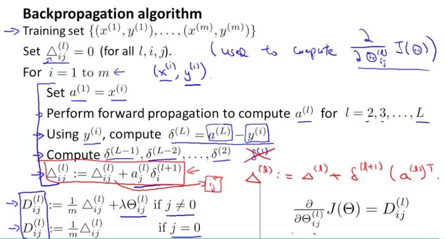

Backpropagation Algorithm
"Backpropagation" is neural-network terminology for minimizing our cost function, just like what we were doing with gradient descent in logistic and linear regression. Our goal is to compute:

minΘJ(Θ)

That is, we want to minimize our cost function J using an optimal set of parameters in theta. In this section we'll look at the equations we use to compute the partial derivative of J(Θ):

∂∂Θ(l)i,jJ(Θ)

To do so, we use the following algorithm:

Back propagation Algorithm

* Given training set {(x(1),y(1))⋯(x(m),y(m))}

* Set \Delta^{(l)}_{i,j}Δ ,j(l)  := 0 for all (l,i,j), (hence you end up having a matrix full of zeros)

For training example t =1 to m:

1. Set a^{(1)} := x^{(t)}a 
(1)
 :=x 
(t)

2.  Perform forward propagation to compute a^{(l)}a 
(l)
  for l=2,3,…,L

3. Using y^{(t)}y 
(t)
 , compute \delta^{(L)} = a^{(L)} - y^{(t)}δ 
(L)
 =a 
(L)
 −y 
(t)
 

Where L is our total number of layers and a^{(L)}a 
(L)
  is the vector of outputs of the activation units for the last layer. So our "error values" for the last layer are simply the differences of our actual results in the last layer and the correct outputs in y. To get the delta values of the layers before the last layer, we can use an equation that steps us back from right to left:

4. Compute \delta^{(L-1)}, \delta^{(L-2)},\dots,\delta^{(2)}δ 
(L−1)
 ,δ 
(L−2)
 ,…,δ 
(2)
  using δ(l)=((Θ(l))Tδ(l+1)) .∗ a(l) .∗ (1−a(l))
The delta values of layer l are calculated by multiplying the delta values in the next layer with the theta matrix of layer l. We then element-wise multiply that with a function called g', or g-prime, which is the derivative of the activation function g evaluated with the input values given by z^{(l)}z 
(l)
 .

The g-prime derivative terms can also be written out as:

g'(z^{(l)}) = a^{(l)}\ .*\ (1 - a^{(l)})g ′ (z (l) )=a (l)  .∗ (1−a (l) )

5. \Delta^{(l)}_{i,j} := \Delta^{(l)}_{i,j} + a_j^{(l)} \delta_i^{(l+1)}Δ 
i,j(l)​	 :=Δ i,j(l)​	 +a j(l)​	 δ i(l+1)​	 or with vectorization, \Delta^{(l)} := \Delta^{(l)} + \delta^{(l+1)}(a^{(l)})^TΔ (l) :=Δ (l) +δ (l+1) (a (l) ) T 

Hence we update our new \DeltaΔ matrix.

D(l)i,j:=1m(Δ(l)i,j+λΘ(l)i,j), if j≠0.
D^{(l)}_{i,j} := \dfrac{1}{m}\Delta^{(l)}_{i,j}D 
i,j
(l)
​	 := 
m
1
​	 Δ 
i,j
(l)
​	  If j=0
The capital-delta matrix D is used as an "accumulator" to add up our values as we go along and eventually compute our partial derivative. Thus we get ∂∂Θ(l)ijJ(Θ)= D_{ij}^{(l)}D 
ij
(l)
​	

