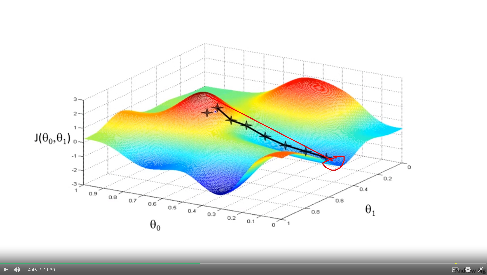
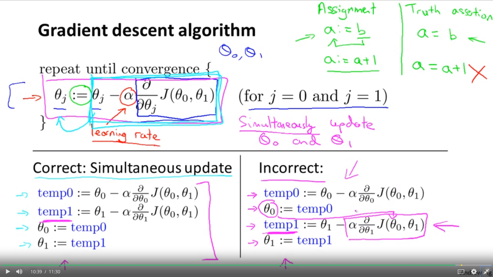

# Gradient Descent

### 0. Motivation
> have algorithm that minimizes the cost function programmatically

* Have some cost function **J(θ<sub>0</sub>θ<sub>1</sub>)**

* Want **min<sub>(θ<sub>0</sub>θ<sub>1</sub>)</sub>** for **J(θ<sub>0</sub>θ<sub>1</sub>)**

* Process Outline:
  * Start with some θ<sub>0</sub>θ<sub>1</sub>
  * Keep changing θ<sub>0</sub>θ<sub>1</sub> to reduce **J(θ<sub>0</sub>θ<sub>1</sub>)** until we hopefully end at minimum

---

### 1. Intro


* Gradient descent is an algorithm that resolves minimizing the cost function.

* It applies to any arbitrary n-tuple cost function 
> **J(θ<sub>0</sub>,θ<sub>1</sub>,θ<sub>2</sub>,..., θ<sub>n</sub>,)** 

  * In 3D, imagine it like going down the hill/net from earlier handwritten notes to arrive at the lowest point possible (may reach local minimum vs global).
    

  * If you're physically standing on a hill and you look 360°and can only see a few steps distance, which direction has the steepest descent, i.e. wold be fastest to go downhill in? Biggest difference on initial step?
    

  * Starting position may influence results, arriving at different local optimum

##### 2. Process

1. Start with some θ<sub>0</sub>θ<sub>1</sub>, (initial guesses..), initialize them to 0, say (θ<sub>0</sub>= 0, θ<sub>1</sub>=0)

> We'll keep changing θ<sub>0</sub> and θ<sub>1</sub> by a little bit to try to reduce **J(θ<sub>0</sub>θ<sub>1</sub>)** until we hopefully end at minimum (local or global)

2. Algorithm


```typescript
var converged = false,
    theta = [],
    j = 0,
    partial_derivative = 0, // ∂
    alpha = 1; // ∝ - learning rate

while (!converged) {
    theta[j] -= gradient_descent(alpha, 
    (partial_derivative / (partial_derivative * theta[j] )), cost_func(theta[0], theta[1]));
    j++;
    converged = converged(theta);
}

```

* What alpha does is set the learning rate. Controls how big a step to take downhill.

* Correct: Simultaneous Update
> SImultaneously update **θ<sub>0</sub>** and **θ<sub>1</sub>**

```javascript
var temp0 = theta[0] - gradient_descent(alpha, (partial_derivative/(partial_derivative*theta[0]), 
cost_function(theta[0], theta[1]));

var temp1 = theta[1] - gradient_descent(alpha, (partial_derivative / (partial_derivative * theta[1], cost_function(theta[0], theta[1]);

theta_zero = temp0;
theta_one = temp1;
```


