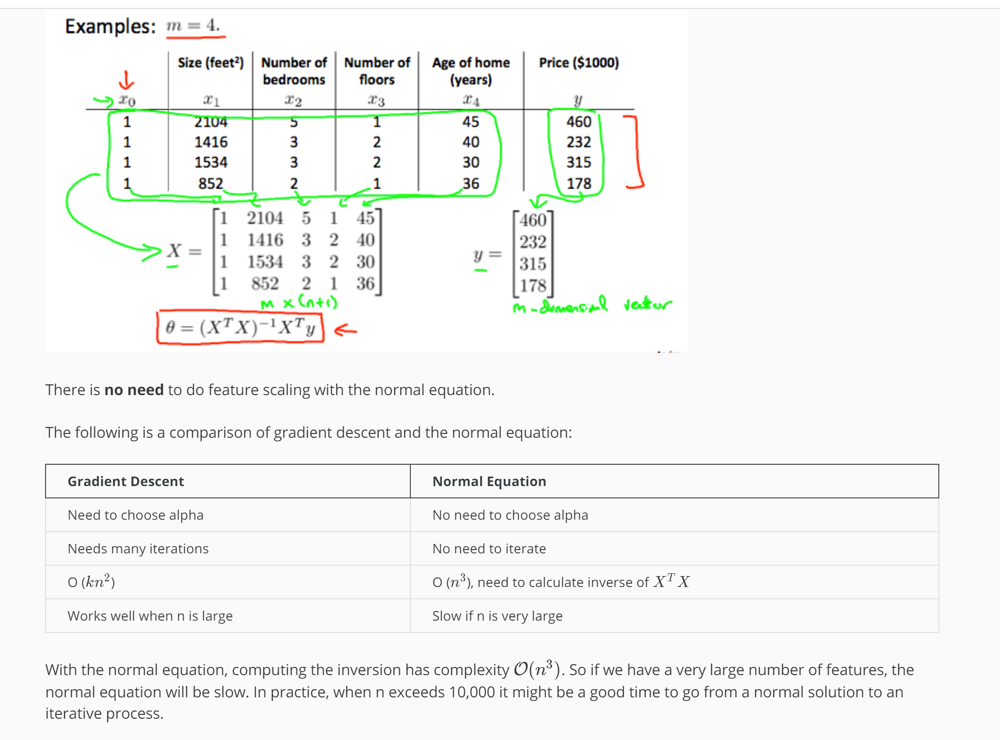

# Normal Equation

Gradient descent gives one way of minimizing J. Let’s discuss a second way of doing so, this time performing the minimization explicitly and without resorting to an iterative algorithm. In the "Normal Equation" method, we will minimize J by explicitly taking its derivatives with respect to the θj ’s, and setting them to zero. This allows us to find the optimum theta without iteration. The normal equation formula is given below:

θ = (XTX)-1XTy

There is no need to do feature scaling with the normal equation.

The following is a comparison of gradient descent and the normal equation:

| Gradient Descent | Normal Equation |
| --- | --- |
| Need to choose alpha | No need to choose alpha |
| O(kn2) | O(n3), need to calculate inverse of XTX |
| Needs many iterations | No need to iterate  |
| Works well when n is large | Slow if n is very large |

With the normal equation, computing the inversion has complexity O(n3). So if we have a very large number of features, the normal equation will be slow. In practice, when n exceeds 10,000 it might be a good time to go from a normal solution to an iterative process.
