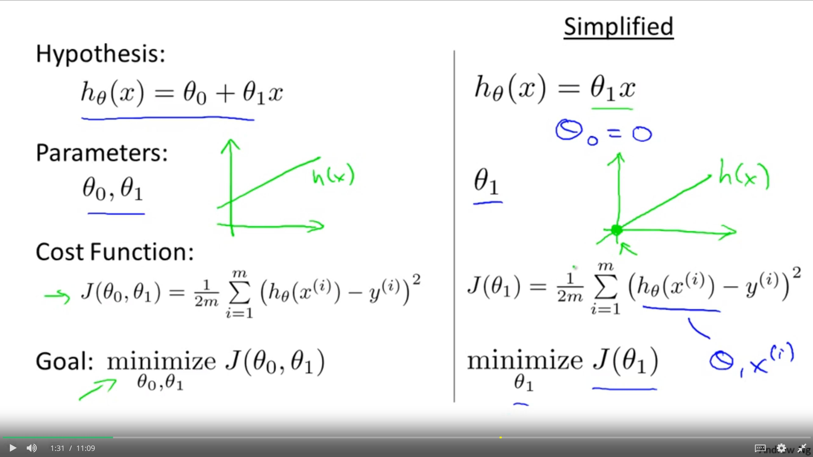
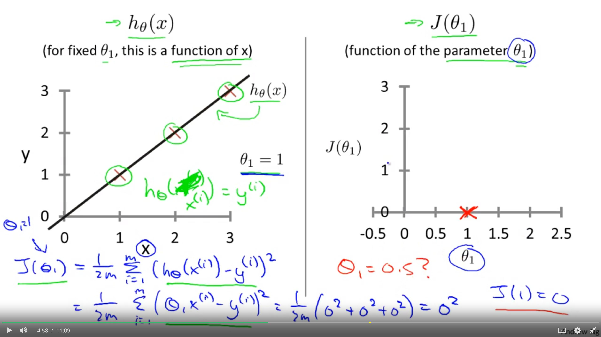

# Intuition - Cost Function

In order to better visualize the cost function J, we'll work with a simplified hypothesis function, like that shown on the right. 

Using the simplified hypothesis, which is just **θ1** times **X**. 

We can think of this as setting the parameter **θ1** = 0 (equal to zero). 

We're left with only one parameter **θ1** and my cost function is similar to before, except that  **hθ(x)** = **θ1x**
-  (H of X) that is now equal to just theta one times X. 

And I have only one parameter **θ1** and my optimization objective is to minimize **J** (cost function) of theta one (**θ1**). 

In pictures, what this means is that if theta **θ1** that corresponds to choosing only hypothesis functions that pass through the origin, that pass through the point **(0, 0)**. 

Using this simplified definition of a hypothesis and cost function, let's try to understand the cost function concept better. 

Two key functions we want to understand:
* hypothesis function 
  * For a face value of theta one, this is a function of X. So the hypothesis is a function of, what is the size of the house X. 
* cost function
  * the cost function, J, that's a function of the parameter, theta one, which controls the slope of the straight line.

## Simplified functions
---

### Hypothesis

On the left, there's a training set with three points at **[(1, 1), (2, 2), and (3, 3)]**. 

Pick a value **θ1**, so when **θ1=1**,  then my hypothesis is going to look like this straight line.

Plotting the hypothesis function, the horizontal axis equal to the input (size of the house) is labeled **X**

Set **θ1=1**, to figure out what is **J(θ1)**, when **θ1=1**. 

Compute what the cost function is for the value 1.

### Cost function
---

**J(θ1)** =  1/2m*(**Σ**mi≡1(**h**θ(**x**(i)) - **y**(i))2)

* = 1/2m*(**Σ**mi≡1(θ(**x**(i)) - **y**(i))2)
* = 1/2m*(02+02+02)
* = 02

Inside the cost function **J**, it turns out each of these terms here is equal to zero. For the specific training set, the 3 training examples are [(1, 1), (2, 2), (3,3)].

If **θ1=1**, then **hθ(x(i))** = **y(i)**.

Each of these terms is equal to zero, which is why  **J(θ1)=0** 

Now know that **J(1)=0** let's plot it.

---

* Cost function **J** is plotted on the right. 
*  cost function is a function of my parameter theta one **J(θ1)**, the horizontal axis is now labeled with **θ1**. 

I have J(0,1) that's plotted. 

Now lets look at some other examples. Theta-1 can take on a range of different values. Right? So theta-1 can take on the negative values, zero, positive values. So what if theta-1 is equal to 0.5. What happens then? Let's go ahead and plot that.