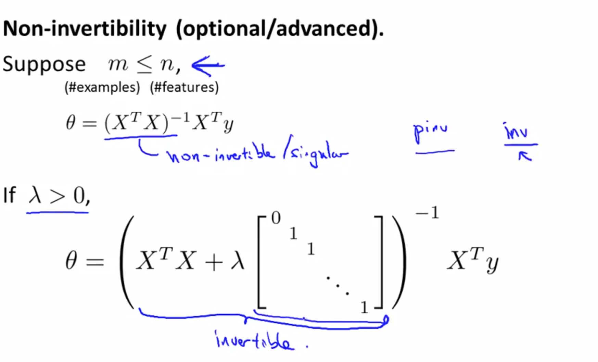
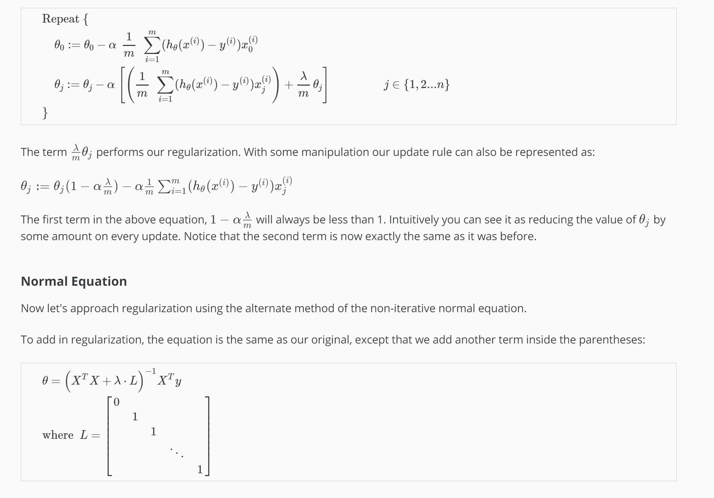

Regularization resolves overfitting and non-invertibility

Note: [8:43 - It is said that X is non-invertible if m \leq≤ n. The correct statement should be that X is non-invertible if m < n, and may be non-invertible if m = n.

We can apply regularization to both linear regression and logistic regression. We will approach linear regression first.

Gradient Descent
We will modify our gradient descent function to separate out \theta_0θ 
0
​	  from the rest of the parameters because we do not want to penalize \theta_0θ 
0
​	 .

Repeat {    θ0:=θ0−α 1m ∑i=1m(hθ(x(i))−y(i))x(i)0    θj:=θj−α [(1m ∑i=1m(hθ(x(i))−y(i))x(i)j)+λmθj]}          j∈{1,2...n}
The term \frac{\lambda}{m}\theta_j 
m
λ
​	 θ 
j
​	  performs our regularization. With some manipulation our update rule can also be represented as:

\theta_j := \theta_j(1 - \alpha\frac{\lambda}{m}) - \alpha\frac{1}{m}\sum_{i=1}^m(h_\theta(x^{(i)}) - y^{(i)})x_j^{(i)}θ 
j
​	 :=θ 
j
​	 (1−α 
m
λ
​	 )−α 
m
1
​	 ∑ 
i=1
m
​	 (h 
θ
​	 (x 
(i)
 )−y 
(i)
 )x 
j
(i)
​	 

The first term in the above equation, 1 - \alpha\frac{\lambda}{m}1−α 
m
λ
​	  will always be less than 1. Intuitively you can see it as reducing the value of \theta_jθ 
j
​	  by some amount on every update. Notice that the second term is now exactly the same as it was before.

Normal Equation
Now let's approach regularization using the alternate method of the non-iterative normal equation.

To add in regularization, the equation is the same as our original, except that we add another term inside the parentheses:

θ=(XTX+λ⋅L)−1XTywhere  L=⎡⎣⎢⎢⎢⎢⎢⎢011⋱1⎤⎦⎥⎥⎥⎥⎥⎥
L is a matrix with 0 at the top left and 1's down the diagonal, with 0's everywhere else. It should have dimension (n+1)×(n+1). Intuitively, this is the identity matrix (though we are not including x_0x 
0
​	 ), multiplied with a single real number λ.

Recall that if m < n, then X^TXX 
T
 X is non-invertible. However, when we add the term λ⋅L, then X^TXX 
T
 X + λ⋅L becomes invertible.

