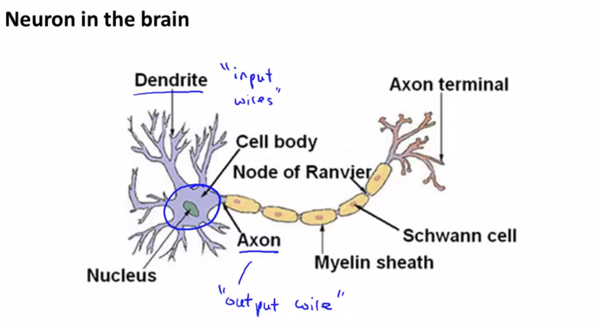
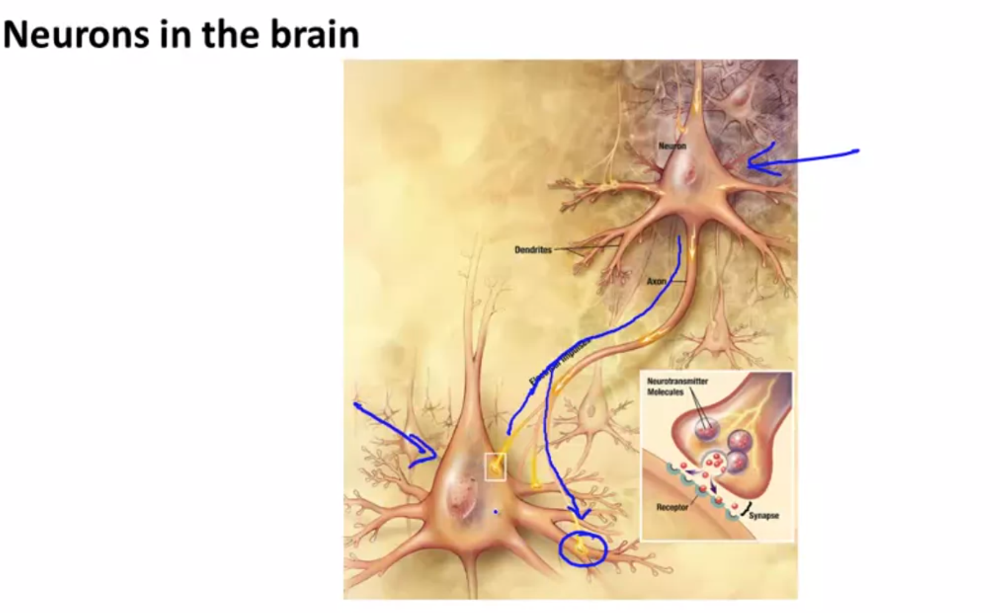
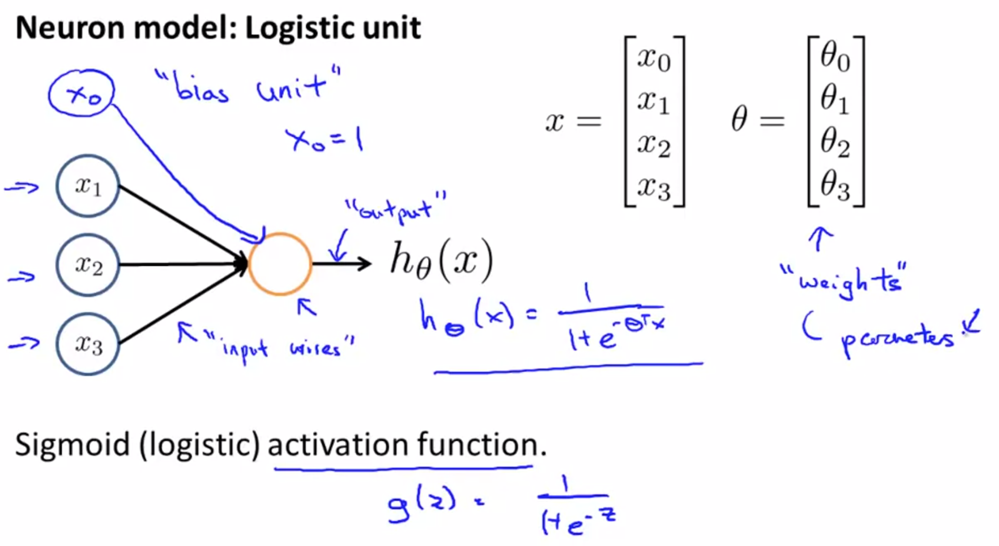
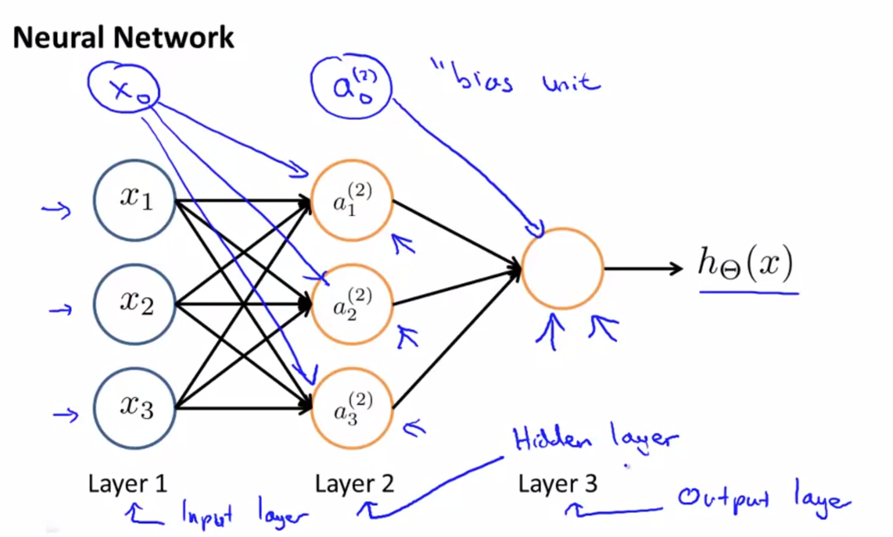
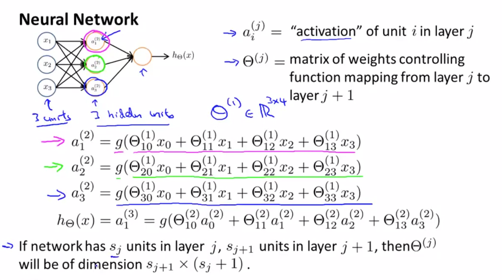

Model Representation I
Let's examine how we will represent a hypothesis function using neural networks. At a very simple level, neurons are basically computational units that take inputs (dendrites) as electrical inputs (called "spikes") that are channeled to outputs (axons). In our model, our dendrites are like the input features x1⋯xn, and the output is the result of our hypothesis function. In this model our x_0x 
0
​	  input node is sometimes called the "bias unit." It is always equal to 1. In neural networks, we use the same logistic function as in classification, \frac{1}{1 + e^{-\theta^Tx}} 
1+e 
−θ 
T
 x
 
1
​	 , yet we sometimes call it a sigmoid (logistic) activation function. In this situation, our "theta" parameters are sometimes called "weights".

Visually, a simplistic representation looks like:

⎡⎣x0x1x2⎤⎦→[   ]→hθ(x)
Our input nodes (layer 1), also known as the "input layer", go into another node (layer 2), which finally outputs the hypothesis function, known as the "output layer".

We can have intermediate layers of nodes between the input and output layers called the "hidden layers."

In this example, we label these intermediate or "hidden" layer nodes a20⋯a2n and call them "activation units."

a(j)i="activation" of unit i in layer jΘ(j)=matrix of weights controlling function mapping from layer j to layer j+1
If we had one hidden layer, it would look like:

⎡⎣⎢⎢x0x1x2x3⎤⎦⎥⎥→⎡⎣⎢⎢⎢a(2)1a(2)2a(2)3⎤⎦⎥⎥⎥→hθ(x)
The values for each of the "activation" nodes is obtained as follows:

a(2)1=g(Θ(1)10x0+Θ(1)11x1+Θ(1)12x2+Θ(1)13x3)a(2)2=g(Θ(1)20x0+Θ(1)21x1+Θ(1)22x2+Θ(1)23x3)a(2)3=g(Θ(1)30x0+Θ(1)31x1+Θ(1)32x2+Θ(1)33x3)hΘ(x)=a(3)1=g(Θ(2)10a(2)0+Θ(2)11a(2)1+Θ(2)12a(2)2+Θ(2)13a(2)3)
This is saying that we compute our activation nodes by using a 3×4 matrix of parameters. We apply each row of the parameters to our inputs to obtain the value for one activation node. Our hypothesis output is the logistic function applied to the sum of the values of our activation nodes, which have been multiplied by yet another parameter matrix Θ(2) containing the weights for our second layer of nodes.

Each layer gets its own matrix of weights, Θ(j).

The dimensions of these matrices of weights is determined as follows:

If network has sj units in layer j and sj+1 units in layer j+1, then Θ(j) will be of dimension sj+1×(sj+1).
The +1 comes from the addition in Θ(j) of the "bias nodes," x_0x 
0
​	  and Θ(j)0. In other words the output nodes will not include the bias nodes while the inputs will. The following image summarizes our model representation:

Example: If layer 1 has 2 input nodes and layer 2 has 4 activation nodes. Dimension of Θ(1) is going to be 4×3 where s_j = 2s 
j
​	 =2 and s_{j+1} = 4s 
j+1
​	 =4, so s_{j+1} \times (s_j + 1) = 4 \times 3s 
j+1
​	 ×(s 
j
​	 +1)=4×3.

