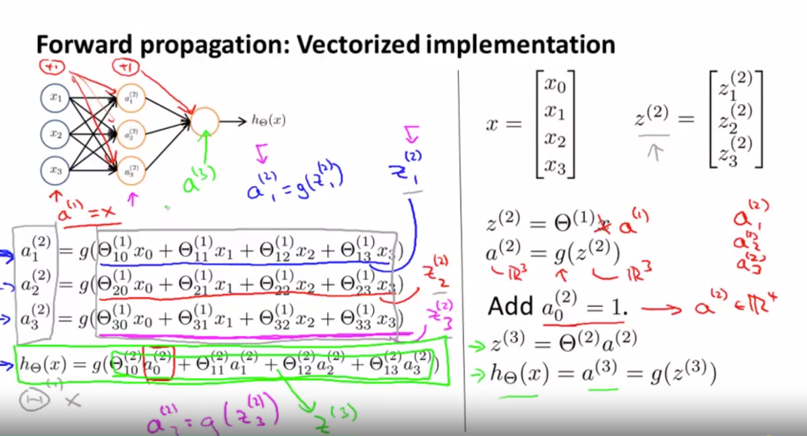
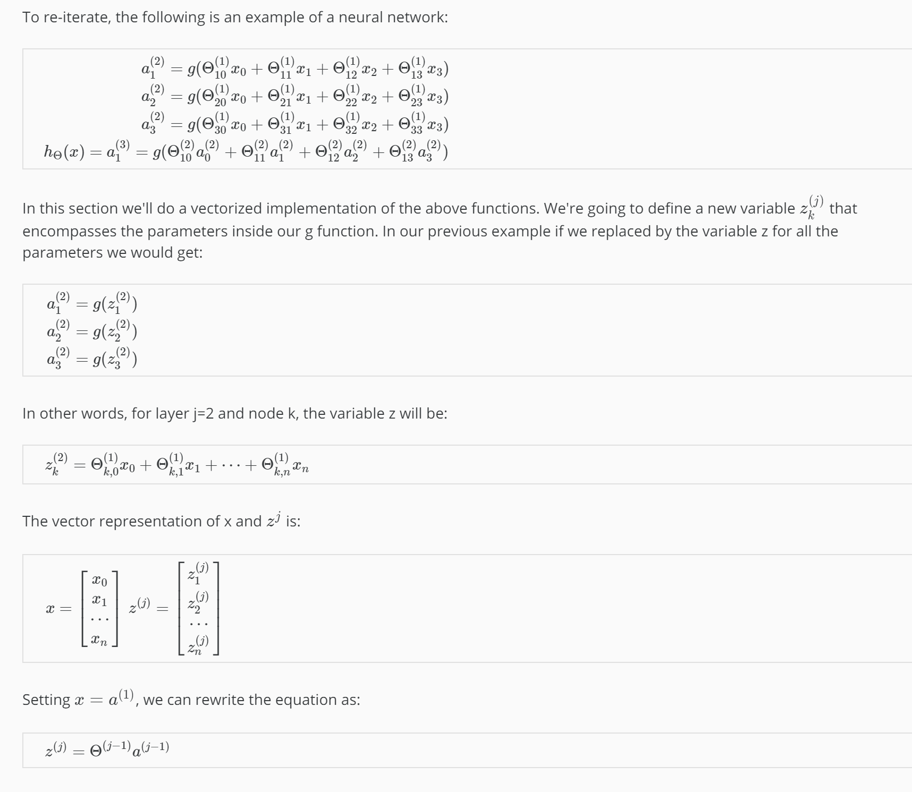

Model Representation II
To re-iterate, the following is an example of a neural network:

a(2)1=g(Θ(1)10x0+Θ(1)11x1+Θ(1)12x2+Θ(1)13x3)a(2)2=g(Θ(1)20x0+Θ(1)21x1+Θ(1)22x2+Θ(1)23x3)a(2)3=g(Θ(1)30x0+Θ(1)31x1+Θ(1)32x2+Θ(1)33x3)hΘ(x)=a(3)1=g(Θ(2)10a(2)0+Θ(2)11a(2)1+Θ(2)12a(2)2+Θ(2)13a(2)3)
In this section we'll do a vectorized implementation of the above functions. We're going to define a new variable z_k^{(j)}z 
k
(j)
​	  that encompasses the parameters inside our g function. In our previous example if we replaced by the variable z for all the parameters we would get:

a(2)1=g(z(2)1)a(2)2=g(z(2)2)a(2)3=g(z(2)3)
In other words, for layer j=2 and node k, the variable z will be:

z(2)k=Θ(1)k,0x0+Θ(1)k,1x1+⋯+Θ(1)k,nxn
The vector representation of x and z^{j}z 
j
  is:

x=⎡⎣⎢⎢x0x1⋯xn⎤⎦⎥⎥z(j)=⎡⎣⎢⎢⎢⎢z(j)1z(j)2⋯z(j)n⎤⎦⎥⎥⎥⎥
Setting x = a^{(1)}x=a 
(1)
 , we can rewrite the equation as:

z(j)=Θ(j−1)a(j−1)
We are multiplying our matrix Θ(j−1) with dimensions s_j\times (n+1)s 
j
​	 ×(n+1) (where s_js 
j
​	  is the number of our activation nodes) by our vector a^{(j-1)}a 
(j−1)
  with height (n+1). This gives us our vector z^{(j)}z 
(j)
  with height s_js 
j
​	 . Now we can get a vector of our activation nodes for layer j as follows:

a^{(j)} = g(z^{(j)})a 
(j)
 =g(z 
(j)
 )

Where our function g can be applied element-wise to our vector z^{(j)}z 
(j)
 .

We can then add a bias unit (equal to 1) to layer j after we have computed a^{(j)}a 
(j)
 . This will be element a_0^{(j)}a 
0
(j)
​	  and will be equal to 1. To compute our final hypothesis, let's first compute another z vector:

z(j+1)=Θ(j)a(j)
We get this final z vector by multiplying the next theta matrix after Θ(j−1) with the values of all the activation nodes we just got. This last theta matrix Θ(j) will have only one row which is multiplied by one column a^{(j)}a 
(j)
  so that our result is a single number. We then get our final result with:

hΘ(x)=a(j+1)=g(z(j+1))
Notice that in this last step, between layer j and layer j+1, we are doing exactly the same thing as we did in logistic regression. Adding all these intermediate layers in neural networks allows us to more elegantly produce interesting and more complex non-linear hypotheses.

